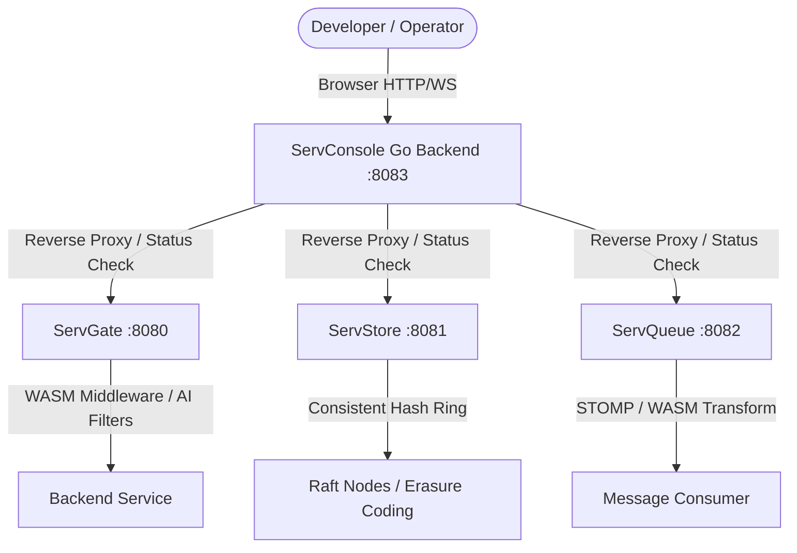

# ServConsole

`ServConsole` is a unified, high-performance management dashboard and observability console tailored for the **Servverse** ecosystem. It provides developer-centric visibility and live management of **ServGate** (API Gateway), **ServStore** (Distributed S3-compatible Storage), and **ServQueue** (WASM-enabled STOMP Message Broker).

With a premium glassmorphic interface, `ServConsole` gives developers a single pane of glass to audit API routing, hot-swap inline WASM code, inspect consistent hash rings, and view distributed OpenTelemetry trace flows.

---

## Key Pillars & Features

### 1. API Gateway Management (ServGate)
* **Live Route Audits**: Instantly view declarative path prefix rules, rates, and proxy targets.
* **WASM Hot-Swapping**: Compile and inject sandboxed WebAssembly request/response modifiers dynamically.
* **AI middleweres audit**: Monitor Prompt Guard violations, Semantic Cache similarity hits, and PII scrubbing rules.

### 2. Message Broker Controller (ServQueue)
* **Compute-in-Queue Controls**: Register or reset WebAssembly pipeline transforms on active queues.
* **Test Message Publisher**: Publish STOMP/JSON payloads directly from the UI with propagated context.
* **Traffic Metrics**: Live counters for publish rates, WASM durations, and runtime errors.

### 3. Distributed Object Storage (ServStore)
* **Consistent Hash Ring Visualizer**: Live SVG/Canvas distribution of ring nodes.
* **Key Route Tracer**: Check key placement to see exactly which consensus peer owns a particular S3 bucket key.
* **Bucket Browser**: Inspect S3 buckets, object sizes, and version metadata.

### 4. Language & Compiler Integration (serv-lang)
* **Trace Timeline Propagation**: Track distributed trace scopes initiated by `serv-lang` compiled actors across network/messaging bounds.
* **Actor State Audit**: View trace span logs emitted by custom `.srv` services directly inside the unified event log.
* **Declarative Schemas**: Visual foundations configured to parse future `serv-lang` compiled database schema actors.

### 5. Observability & Telemetry
* **OTel Span Waterfall**: View nested spans across network boundaries (Gateway ➔ Queue ➔ Storage) in a custom waterfall chart.
* **Ecosystem Event Console**: Real-time unified logs from all microservices.

---

## Architecture Flow



---

## Security & Authentication

### Token Proxy Forwarding
To maintain security parity and avoid Cross-Origin Resource Sharing (CORS) complications, `ServConsole` acts as a secure reverse proxy:
* **Authorization Headers**: Client requests are proxied internally through `ServConsole` to downstream servers. `ServConsole` dynamically appends necessary token authorizations (e.g. `Bearer gateway-secret-token` for ServGate) based on config settings.
* **Zero-Trust Standalone Mode**: Downstream engines can still run in completely isolated standalone mode behind standard auth checks.

---

## Quick Start

### 1. Build and Run
Ensure Go 1.21+ is installed, then build and run the console binary:
```bash
go build -o servconsole.exe main.go
./servconsole.exe --port=8083
```

### 2. CLI Options
You can configure downstream URLs and credentials when starting the console:
```bash
./servconsole.exe \
  --port=8083 \
  --gate-url=http://localhost:8080 \
  --store-url=http://localhost:8081 \
  --queue-url=http://localhost:8082 \
  --gate-config=../ServGate/config.json
```

---

## Observability Specs

`ServConsole` integrates with the standard OpenTelemetry schema. When downstream services emit spans, they are captured and can be visualized under the **Telemetry** dashboard pane.
* Traces are collected via the `/console/traces` endpoint exposed by the ServStore backend telemetry cache.
* Traces adhere to the W3C Trace Context standard (`traceparent` header).
